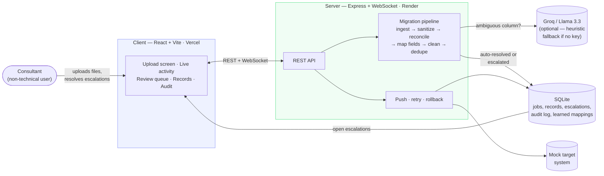

# Darwin — AI Agent for Client Data Migration & Integration

An agent that migrates a fictitious client's HR data from multiple inconsistent source
exports into a target platform, autonomously mapping fields, cleaning values, and
reconciling records — stopping to ask a human only when it hits something it genuinely
can't resolve on its own. Wrapped in a web UI built for a non-technical implementation
consultant to supervise the run, resolve escalations, and inspect a full audit trail.

**Live demo:** [client-omega-seven-20.vercel.app](https://client-omega-seven-20.vercel.app)
(server: [darwinbox-9iho.onrender.com](https://darwinbox-9iho.onrender.com), free tier —
the first request after a period of inactivity may take ~30-50s to wake it up).

## Tech stack

- **Server**: Node.js + TypeScript, Express, `better-sqlite3` (audit trail + job state),
  `ws` (live activity feed over WebSocket), `csv-parse` / `xlsx` (ingestion).
- **Client**: React + Vite + TypeScript, no UI framework — hand-built components styled
  to a minimal, restrained aesthetic (plain CSS, no component library).
- **Agent LLM**: [Groq](https://console.groq.com) serving Llama 3.3 70B (open-source
  model) for column-mapping decisions. **The pipeline runs fully without any API key** —
  see "Running without an LLM" below — which is also how this repo ships by default.

## Setup

Requires Node.js 20+.

```bash
npm install                      # installs both server and client workspaces
cp server/.env.example server/.env
# optional: add GROQ_API_KEY to server/.env — see below
npm run dev:server               # starts the API + WebSocket server on :8787
npm run dev:client               # in a second terminal, starts the UI on :5173
```

Open `http://localhost:5173`. Click **"Try sample dataset"** to run the agent against
the bundled sample files in `data/sample-sources/`, or drag in your own CSV/XLSX exports.

Run **"Try sample dataset" twice in a row** to see the per-client learned-mapping
feature in action: the first run escalates 3 ambiguous column mappings; resolve them
in the Review queue, then run the sample again — the UI shows a "3 learned mappings"
badge and those same columns auto-resolve instead of re-escalating.

### Tests

```bash
cd server && npm test
```

Runs the unit test suite (`node:test`, no extra dependency) covering the two modules
where a silent regression would be most damaging: the mapping confidence/gap-check
escalation boundary, the cleaning module's date-ambiguity and enum-normalization
logic, and the CSV/formula-injection sanitizer.

### Running without an LLM

By default `GROQ_API_KEY` is empty and the mapping engine falls back to a deterministic
heuristic (token overlap + substring containment + value-shape inference against the
target schema's field aliases). This is intentionally more conservative than the LLM
path — it escalates more readily — but it means the whole pipeline, UI, and demo are
runnable with zero external dependencies or cost. A "Heuristic mode" badge appears in
the UI whenever no key is configured.

To use the LLM path: get a free key at <https://console.groq.com/keys>, add it to
`server/.env` as `GROQ_API_KEY`, and restart the server.

## What's in the sample dataset

Three source files simulating a client migrating off a patchwork of HR tools:

- `core_hr_export.csv` — the primary HR system export. Inconsistent name casing,
  mixed date formats, some missing fields, a near-duplicate record (misspelled name,
  different email).
- `payroll_system_export.csv` — a payroll system's own export of largely the same
  people, with entirely different column names (`personnel_number`, `dept_code`,
  `hire_dt`) and department codes (`ENG`, `SLS`) instead of names.
- `contractor_tracker.xlsx.csv` — a separate contractor-tracking spreadsheet with a
  different shape again (`full_name` instead of split first/last, `Engagement Type`
  instead of `employee_type`), several contractors with no corresponding HR record,
  one row that's actually the same person as a `core_hr_export.csv` row, and one row
  with a formula-injection payload in a free-text "Notes" cell (`=HYPERLINK(...)`) to
  exercise the input-sanitization guard.

Together these exercise every acceptance criterion: multi-file reconciliation of one
entity from divergent schemas, safe autonomous cleanup, and escalation only where a
mapping or value is genuinely ambiguous.

## Architecture

```
data/sample-sources/         sample CSVs
server/src/
  schema/targetSchema.ts     the target platform's employee schema (given/defined spec)
  pipeline/
    ingest.ts                CSV/XLSX parsing → uniform rows
    sanitize.ts              CSV/formula-injection guard + file-size limits (security boundary)
    reconcile.ts              groups rows across files into one entity per employee
    mapping.ts                column → target field proposals + confidence scoring
    cleaning.ts               deterministic value cleaning, date parsing, dedup logic
    orchestrator.ts           runs the full pipeline, writes DB state, emits live events
    push.ts                   mock target API push, retry, rollback
    mockTargetApi.ts          simulated flaky target system
    resolveEscalation.ts      applies a human's approve/correct/reject decision, learns overrides
    __tests__/                unit tests (node:test) for mapping, cleaning, sanitize
  db/
    schema.sql                jobs, records, escalations, audit_log, mapping_overrides
    mappingOverrides.ts        per-client learned column-mapping lookups
    audit.ts                  audit log writer
  routes/api.ts              REST endpoints
  lib/eventBus.ts            WebSocket live-feed + per-job event backlog
client/src/
  components/                UploadScreen, ActivityFeed, EscalationQueue, RecordsTable, AuditLog
```

The pipeline is a straight-line run per job: ingest → map columns → reconcile +
clean → detect duplicates → (human resolves anything escalated) → push → (retry/rollback
as needed). Every step writes to `audit_log`; nothing is pushed to the target system
while a record still has an open escalation against it.

### Architecture diagram



The human only enters the loop to resolve what's in the review queue; everything
else — ingestion, mapping, cleaning, dedup, and the push itself — runs unattended,
and nothing reaches the target system while a record still has an open escalation.

## Deploying (optional — split client/server deployment)

This is two independent services, not a monolith, so they deploy to two different
places. This app is deployed live: client on Vercel, server on Render.

- **Client** (static after `vite build`) → Vercel. Project root `client/`, build
  command `npm run build`, output directory `dist`. Add an environment variable
  `VITE_API_BASE_URL` pointing at the server's origin (e.g.
  `https://darwinbox-9iho.onrender.com`, no trailing slash) — `VITE_`-prefixed
  vars are baked into the client bundle at build time, so this isn't a secret,
  just config; set it as a plain "Config" value, not "Secret," in Vercel.
- **Server** (long-running Express + WebSocket process, needs a persistent
  filesystem for its SQLite file) → Render, Railway, or Fly.io — **not** Vercel:
  Vercel's serverless functions are stateless/short-lived and can't hold open a
  WebSocket connection or write to a durable local file. **Leave Render's Root
  Directory blank** (repo root), since this is an npm-workspaces monorepo and a
  scoped root directory breaks the workspace-aware install (see gotcha #1
  below). Build command `npm install && npm rebuild better-sqlite3 --workspace=server
  && npm run build --workspace=server`, start command `npm start --workspace=server`.
  Add `CLIENT_ORIGIN` set to the exact Vercel URL, **no trailing slash** — CORS
  does an exact string match against the browser's `Origin` header, which never
  includes a trailing slash, so a mismatched slash silently drops all CORS
  headers instead of erroring (leave `CLIENT_ORIGIN` unset for local dev, where
  it's permissive by default).

No `GROQ_API_KEY` is required in either environment — the deployed app runs in the
same fully offline heuristic mode described above.

### Deploy gotchas hit in practice (and why)

Getting this onto Render surfaced two real bugs that never showed up in local dev,
both worth documenting because they're exactly the class of "works on my machine"
issue a forward-deployed engineer has to diagnose blind, from logs alone, against
someone else's infrastructure:

1. **`schema.sql` missing from the compiled build.** `server/src/db/client.ts`
   reads `schema.sql` from a path relative to its own module (`__dirname`). In
   dev, `npm run dev` runs `tsx` directly against `src/`, where the SQL file sits
   right next to the TypeScript that reads it — no problem. `tsc`, however, only
   emits compiled `.js`; it doesn't copy non-TypeScript files into `dist/`. So
   `npm start` (which runs the compiled `dist/index.js`) threw `ENOENT` looking
   for `dist/db/schema.sql`, which simply never existed. This was invisible
   until the first time the compiled build actually ran, which was on Render's
   first deploy. Fixed by adding a copy step to the `build` script.
2. **`better-sqlite3` native-module ABI mismatch.** `better-sqlite3` ships a
   prebuilt native `.node` binary compiled against a specific Node ABI version.
   Render defaulted to the newest available Node (24.x) on the first deploy,
   which crashed the process on shutdown/cleanup with a native assertion
   failure — not on startup, which made it look like an intermittent crash-loop
   rather than an obvious incompatibility. Pinning Node via `.node-version`
   (20.x, matching this repo's stated requirement) fixed the *runtime* version,
   but Render's dependency cache had already installed the native module against
   the old Node version, and a plain `npm install` doesn't detect or fix an ABI
   mismatch on its own — it only checks declared version ranges, not the
   compiled binary's actual ABI. The real fix needed an explicit
   `npm rebuild better-sqlite3`, which forces recompilation against whichever
   Node is currently active, in the build command.

## Write-up

See `docs/WRITEUP.md` for the one-page approach summary: how the escalation boundary was
drawn and why, and what's next.
